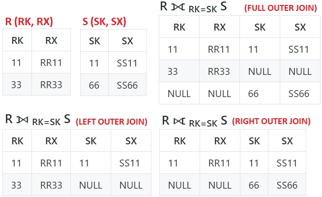

## [Tópico T13] - Álgebra Relacional - Junção Externa
###### *by Prof. Plinio Sa Leitao-Junior (INF/UFG)*

Para apoiar os exemplos das operações da Álgebra Relacional, considere a ilustração abaixo do **BD Empresa**.

### Operação JUNÇÃO EXTERNA (OUTER JOIN)

As variações da Operação JUNÇÃO **estudadas até o momento** (a saber, JUNÇÃO THETA, EQUIJUNÇÃO e JUNÇÃO NATURAL) são denominadas JUNÇÃO INTERNA (INNER JOIN):
- Na JUNÇÃO INTERNA entre **R** e **S**, as combinações de _tuplas_ de **R** e **S** (ou seja, a concatenação de uma _tupla_ de **R** com uma _tupla_ de **S**) devem atender ao **predicado de junção**:
  - as combinações, nas quais o **predicado de junção** é avaliado como falso, são eliminadas do (não estão presentes no) resultado da junção.

Por exemplo, "_Qual o nome dos empregados e o nome dos departamentos que gerenciam?"_:
- uma expressão para a consulta é:
  - **π Pnome, Unome, Dnome (FUNCIONARIO ⨝ Cpf = Cpf_gerente DEPARTAMENTO)**;
- o predicado de junção presente nesta expressão é:
  - **Cpf = Cpf_gerente**;
- o resultado da junção **somente inclui** as _tuplas_ em que o _predicado de junção_ é avaliado como _verdadeiro_:
  - o resultado da junção está a seguir, conforme a ilustração do **BD Empresa** mostrada acima.

|Pnome|Unome|Dnome|
|-|-|-|
|Fernando|Wong|Pesquisa|
|Jennifer|Souza|Administração|
|Jorge|Brito|Matriz|

#### JUNÇÃO EXTERNA Exemplo 1:

No exemplo "_Qual o nome dos empregados e, para aqueles que são gerentes, o nome dos departamentos que gerenciam?"_:
- A consulta é uma JUNÇÃO EXTERNA À ESQUERDA;
- A expressão é:
  - **π Pnome, Unome, Dnome (FUNCIONARIO ⟕ Cpf = Cpf_gerente DEPARTAMENTO)** ;
  - observe o uso do símbolo ⟕ (em vez de ⨝).
- O resultado da consulta é exibido abaixo.

|Pnome|Unome|Dnome|
|-|-|-|
|João|Silva|NULL|
|Fernando|Wong|Pesquisa|
|Alice|Zelaya|NULL|
|Jennifer|Souza|Administração|
|Ronaldo|Lima|NULL|
|Joice|Leite|NULL|
|André|Pereira|NULL|
|Jorge|Brito|Matriz|

#### JUNÇÃO EXTERNA Exemplo 2:

No exemplo "_Qual o nome dos empregados e, para aqueles que possuem dependentes, o nome dos seus dependentes?"_:
- A consulta é uma JUNÇÃO EXTERNA À ESQUERDA;
- A expressão é:
  - **π Pnome, Unome, Nome_dependente (FUNCIONARIO ⟕ Cpf = Fcpf DEPENDENTE)** ;
  - observe o uso do símbolo ⟕ (em vez de ⨝).
- O resultado da consulta é exibido abaixo.

|Pnome|Unome|Nome_dependente|
|-|-|-|
|João|Silva|Michael|
|João|Silva|Alicia|
|João|Silva|Elizabeth|
|Fernando|Wong|Alicia|
|Fernando|Wong|Tiago|
|Fernando|Wong|Janaina|
|Alice|Zelaya|NULL|
|Jennifer|Souza|Antonio|
|Ronaldo|Lima|NULL|
|Joice|Leite|NULL|
|André|Pereira|NULL|
|Jorge|Brito|NULL|

#### JUNÇÃO EXTERNA Exemplo 3:

Na JUNÇÃO EXTERNA entre R e S, a relação resultante possui:
- as _tuplas_ do resultado da JUNÇÃO INTERNA; e
- as _tuplas_ de **R e/ou S**, quando o **predicado de junção** não é avaliado como verdadeiro.

Há três variações de JUNÇÃO EXTERNA:
- JUNÇÃO EXTERNA À ESQUERDA (LEFT OUTER JOIN), cujo símbolo é ⟕ ;
- JUNÇÃO EXTERNA À DIREITA (RIGHT OUTER JOIN), cujo símbolo é ⟖ ;
- JUNÇÃO EXTERNA COMPLETA (FULL OUTER JOIN), cujo símbolo é ⟗ .

Abaixo são mostrados exemplos para as três variações da operação JUNÇÃO EXTERNA.

Na JUNÇÃO INTERNA (INNER JOIN): **R ⨝ RK = SK S**

|RK|RX|SK|SX|
|-|-|-|-|
|11|RR11|11|SS11|

## Atividade (data limite: **07/02/2022 23h59min59s**)

Seja o esquema relacional simplificado abaixo:
-	VENDE ( Bar, Cerveja )
-	GOSTA ( Pessoa, Cerveja )

A relação VENDE refere-se aos bares e às marcas de cerveja que lá são vendidas. 
A relação GOSTA representa marcas de cervejas e pessoas que gostam delas.

Criar uma _issue_ no projeto https://github.com/plinioleitao/bd-2021-2-bec, com o título "Tópico 13", para responder:  

Escreva em álgebra relacional as seguintes consultas:
1. Quais as cervejas vendidas no bar “Pipoca”?
1. Quais as pessoas que gostam de alguma(s) cerveja(s) vendida(s) no bar “Pipoca”?
1. Quais as pessoas que não gostam de qualquer das cervejas vendidas no bar “Pipoca”?
1. Quais as pessoas cujas cervejas que gostam são todas vendidas no bar “Pipoca”?

IMPORTANTE: Use a sintaxe da Álgebra Relacional conforme os exemplos apresentados até então.

RESPOSTAS:

1. RESULT ← π Cerveja ( σ Bar=”Pipoca” (VENDE) )
2. RESULT ← π Pessoa ( σ Bar=”Pipoca” (VENDE * GOSTA) )
3. TEMP ← π Pessoa ( σ Bar=”Pipoca” (VENDE * GOSTA) ) 
RESULT ← π Pessoa (GOSTA) - TEMP
4. TEMP ← π Cerveja (VENDE) - π Cerveja ( σ Bar = "Pipoca" (VENDE) ) 
RESULT ← π Pessoa (GOSTA) - π Pessoa (TEMP * GOSTA) )

DÚVIDAS: Sejam as relações VENDE e GOSTA abaixo.

VENDE
|Bar|Cerveja|Questão|
|-|-|-|
|Alfredo|Skol||
|Alfredo|Cerpa||
|Pipoca|Skol|1|
|Pipoca|Brahma|1|
|Roberval|Cerpa||
|Roberval|Devassa||

GOSTA
|Pessoa|Cerveja|Questão|
|-|-|-|
|Carlos|Skol|2, 4|
|Carlos|Brahma|2, 4|
|Bia|Brahma|2|
|Bia|Cerpa||
|Bia|Skol|2|
|Alfredo|Skol|2|
|Adriana|Devassa|3|

**Abaixo está uma solução à Questão 03?**
- BAR ← σ Bar = pipoca (VENDE) [**corrigir ausência de aspas em literais do tipo _string_**] 
CONT(Pessoa, Qtde) ← Pessoa ℑ CONTA Cerveja (GOSTA ⨝ Cerveja = Cerveja BAR) [**desambiguar atributos**] 
&nbsp;&nbsp;&nbsp;&nbsp;&nbsp;&nbsp;&nbsp;&nbsp;&nbsp;&nbsp;_Preferir: (GOSTA ⨝ GOSTA.Cerveja = BAR.Cerveja BAR)_
AUX ← σ Qtde = 0 (CONT) 
RESULTADO ←π Pessoa(AUX * GOSTA)

BAR
|Bar|Cerveja|
|-|-|
|Pipoca|Skol|
|Pipoca|Brahma|

CONT
|Pessoa|Qtde|
|-|-|
|Carlos|2|
|Bia|2|
|Alfredo|1|

Então ... RESULTADO é um conjunto vazio.

**Abaixo está uma solução à Questão 04?**
- CERV_PIPOCA ← π cerveja (σ bar = "Pipoca" (VENDE)) 
RESULT ← π pessoa (GOSTA ÷ CERV_PIPOCA)

**Abaixo está uma solução à Questão 04?**
- BAR(Cerveja_do_bar) ← π Cerveja (σ Bar = pipoca (VENDE)) 
AUX ← π Pessoa, Cerveja, Cerveja_do_bar (GOSTA ⟕ Cerveja = Cerveja_do_bar BAR) 
GOSTAM ← πPessoa(σ Cerveja_do_bar != null (AUX)) 
NGOSTAM ← πPessoa(σ Cerveja_do_bar = null (AUX)) 
RESULTADO ← GOSTAM - NGOSTAM

## Artefatos

1. _Issue_ criada no projeto https://github.com/plinioleitao/bd-2021-2-bec, cujo título é "Tópico 13", para praticar operações da *álgebra relacional*.
