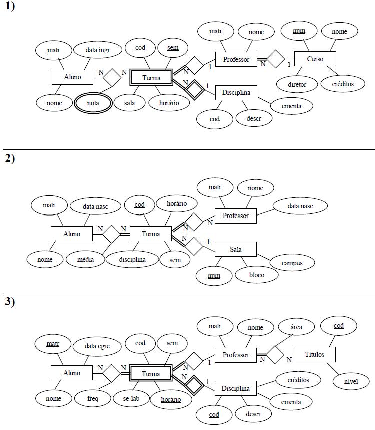

## [Tópico T22a] - Modelo Entidade Relacionamento (MER) - Exercício
###### *by Prof. Plinio Sa Leitao-Junior (INF/UFG)*

Considere que a universidade precisa de um banco de dados, no contexto de um software de controle acadêmico. Três projetistas foram convidados para o desenvolvimento do esquema conceitual de banco do dados. Como resultado, cada projetista produziu um diagrama (DER) particular, conforme ilustrado a seguir.

Sobre os diagramas, vale esclarecer:
- O tipo de entidade _Disciplina_ descreve o conjunto das disciplinas a serem ofertadas aos alunos:
  - O tipo de entidade _Turma_ denota a oferta de uma disciplina em semestre e ano específicos.
- O atributo _sem_ refere-se ao semestre e ao ano em que uma turma é ofertada.
- O atributo _se_lab_ indica se uma turma ofertada possui aulas de laboratório.
- Os atributos _data_ingr_ e _data_egre_ referem-se à data de ingresso e de egresso do aluno na instituição, respectivamente.
- O atributo _freq_ refere-se à frequência de um aluno em uma turma.
- O tipo de entidade _Título_ refere-se às titulações de cada professor; por exemplo, nível mestrado.
- O atributo _horário_ determina o dia da semana e a hora para a turma (multivalorado?).
- O atributo _créditos_ refere-se à carga horária (CH):
  - semanal para uma disciplina; ou
  - total de um curso.
- Para ser aprovado, um aluno deve ser aprovado por frequência e por média:
  - um aluno é reprovado por média, se a média aritmética de notas for inferior a 7.0;
  - um aluno é reprovado por frequência, se a frequência for inferior a 75 %.

Para responder as perguntas abaixo, considere o somatório das seguintes opções: 
(01) Quando o Diagrama 1 atende ao solicitado. 
(02) Quando o Diagrama 2 atende ao solicitado. 
(04) Quando o Diagrama 3 atende ao solicitado. 

### Exercício 01. Que diagrama(s) cobre(m) às demandas informacionais abaixo?

1. Relação de professores que possuem mestrado ou doutorado
1. Os professores que possuem turma com aulas de laboratório em um semestre.
1. A quantidade de turmas oferecidas em um semestre.
1. O código e ementa das disciplinas com turma oferecida em um semestre.
1. A carga horária de cada professor em um semestre.
1. As turmas oferecidas em um determinado semestre, apresentando horário e sala.
1. A quantidade de créditos das aprovações de cada aluno.
1. A idade que os alunos tinham quando ingressaram na instituição.
1. A idade que os professores tinham quando ingressaram na instituição.
1. A quantidade de reprovações por média de cada aluno.
1. A quantidade de reprovações por frequência de cada aluno.
1. A relação de professores que obtiveram doutorado em 2002.
1. Para cada professor, a quantidade de turmas oferecidas em laboratório.
1. A ementa das disciplinas com turmas oferecidas em um semestre para um certo professor.
1. Para cada aluno, os professores de suas turmas em um semestre.
1. O nome e matrícula dos alunos das turmas oferecidas em um semestre.
1. O nome e matrícula dos alunos das turmas oferecidas em um bloco de um campus.
1. A matrícula e nome de um professor, e o diretor do curso em o professor está associado.
1. A data de aniversário de cada professor.
1. A data de aniversário de cada diretor de curso.

### Exercício 02. Que diagrama(s) possui(em) as restrições abaixo:

1. Uma turma pode existir sem alunos, mas não pode existir sem professor.
1. Toda turma possui no máximo um professor, não existindo turma sem professor.
1. O atributo cod do tipo de entidade Turma possui restrição unicidade de dados.
1. Duas turmas podem ser oferecidas de uma mesma disciplina, em um mesmo semestre e em um  mesmo horário.
1. Um mesmo aluno pode possuir diversas turmas de um mesmo professor em um mesmo semestre.
1. Um mesmo professor pode possuir vários telefones.
1. Um aluno pode não estar matriculado em que qualquer turma em um determinado semestre.
1. Turma é um tipo entidade fraca que depende do professor para sua identificação.
1. Não existe professor sem qualquer turma associada.
1. Uma turma pode existir mesmo sem nenhum aluno associado.

## Não há atividade para este tópico, excepcionalmente.
